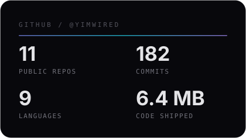
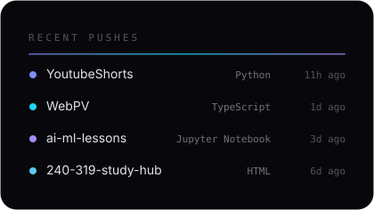

### I build things that ship

Web experiences, AI agents, trading systems and content pipelines.
Designed, built and operated end to end, solo.

- 📍 Thailand · UTC+7
- 🌐 Portfolio: **[webpv.vercel.app](https://webpv.vercel.app)** · try **[The Lab](https://webpv.vercel.app/labs)**, one portfolio in six visual languages
- 📫 **yimwired@gmail.com**

---

### Stack

**Ship**
     

**Think**
  

**Move**
   

---

### Currently shipping

- **[WebPV](https://github.com/yimwired/WebPV)** · portfolio + *The Lab*, the same site rebuilt in six visual languages
- **AURUM** · automated XAU/USD terminal, 12 strategy engines on MT5 with live risk controls
- **Jarvis (Moon Fleet)** · multi-agent orchestrator, 11 specialised Claude agents behind one commander
- **Affiliate Publisher** · one post to YouTube, TikTok, Shopee Shorts and Lemon8 at once
- **You Are the Virus** · browser strategy game: infect, mutate, survive

---

### Snapshot

 

**Open for freelance web work** - fast turnaround, distinctive design, no templates.
Start here: **[webpv.vercel.app](https://webpv.vercel.app)**
